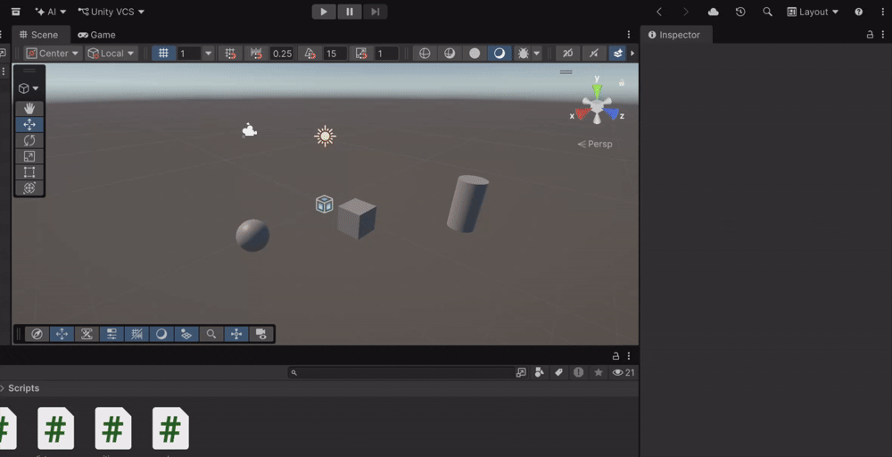
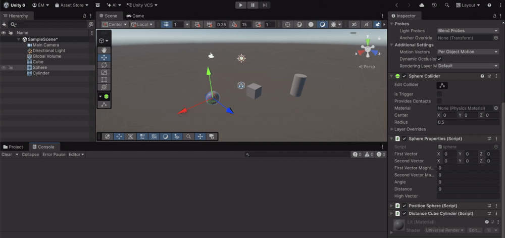
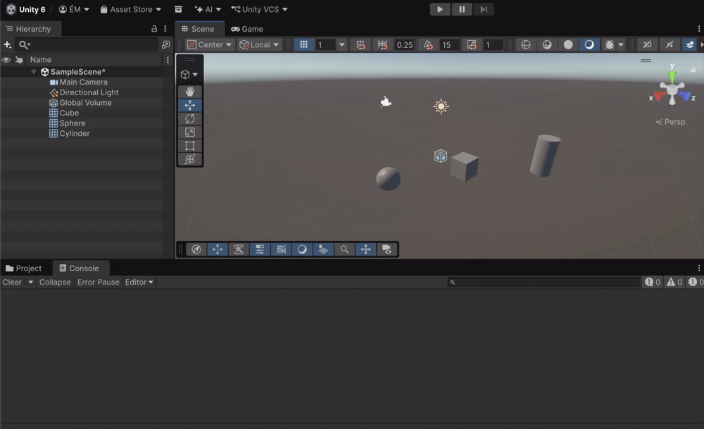
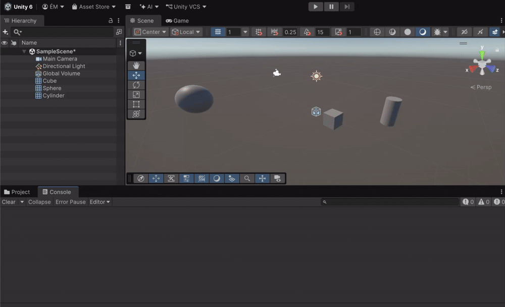

# Introducción scripts
Asignatura: Interfaces Inteligentes — Curso 2026/27

Érika Crespo Molero

alu0101639185@ull.edu.es

## Hitos
En estos ejercicios se ha aprendido a trabajar en la creación de scripts en C# para Unity asociados a objetos de la escena, aplicando el ciclo de vida Start y Update, variables públicas editables desde el Inspector y depuración con Debug.Log. En el primer ejercicio implementé un cambio de color aleatorio cada N frames, parametrizable desde el Inspector, usando Random y Renderer.material.color. En el segundo, a partir de dos Vector3 configurados en el Inspector, calculé y mostré su magnitud, el ángulo entre ellos, la distancia y cuál está a mayor altura. En el tercero, mostré la posición de la esfera accediendo a transform.position. En el cuarto, busqué el cubo y el cilindro mediante GameObject.FindWithTag y calculé la distancia entre la esfera y cada uno con Vector3.Distance. Con ello practiqué el manejo de componentes, transform, etiquetas, vectores y depuración en consola.

### Ejercicio 1
El objeto cambia de color cada tantos frames indicados con un RGB aleatorio, y ese intervalo se puede modificar desde el Inspector.

### Ejercicio 2
Al iniciar, la consola y el Inspector muestran la magnitud de cada vector, el ángulo entre ellos, su distancia y cuál está más alto.

### Ejercicio 3
Al iniciar, la consola imprime la posición exacta de la esfera en el espacio 3D mediante transform.position.

### Ejercicio 4
Al iniciar, la consola muestra la distancia de la esfera al cubo y al cilindro, localizándolos por sus etiquetas.

